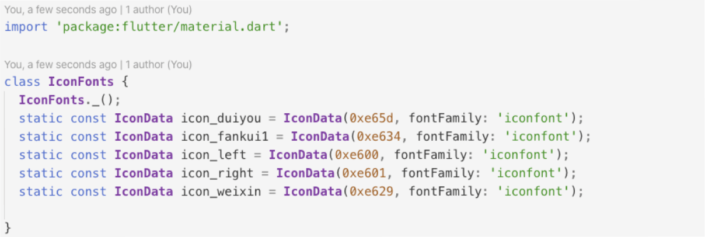

<!--
 * @Author: meetqy
 * @since: 2019-07-26 10:18:13
 * @lastTime: 2019-11-04 16:15:25
 * @LastEditors: meetqy
 -->
# iconfont_dart

iconfont to dart.Icon can be implemented by calling iconfont classname.

iconfont转dart。通过调用iconfont的classname即可返回Icon。

## 生成dart文件预览



## 使用

```
import 'package:iconfont_dart/iconfont_dart.dart';

main() {
  IconfontDart(
    '../lib/assets/fonts/demo_index.html', 
    './a.dart'
  );
}
```

> 注意：通过 dart xxx.dart 执行生成dart文件

## 参数介绍
- @dir: iconfont中 demo_index.html 目录
- @buildDir: 生成dart文件路径
- @className: 生成的类名

## 仓库地址

- [https://github.com/meetqy/iconfont_dart](https://github.com/meetqy/iconfont_dart)
- [https://pub.dev/packages/iconfont_dart#-readme-tab-](https://pub.dev/packages/iconfont_dart#-readme-tab-)


