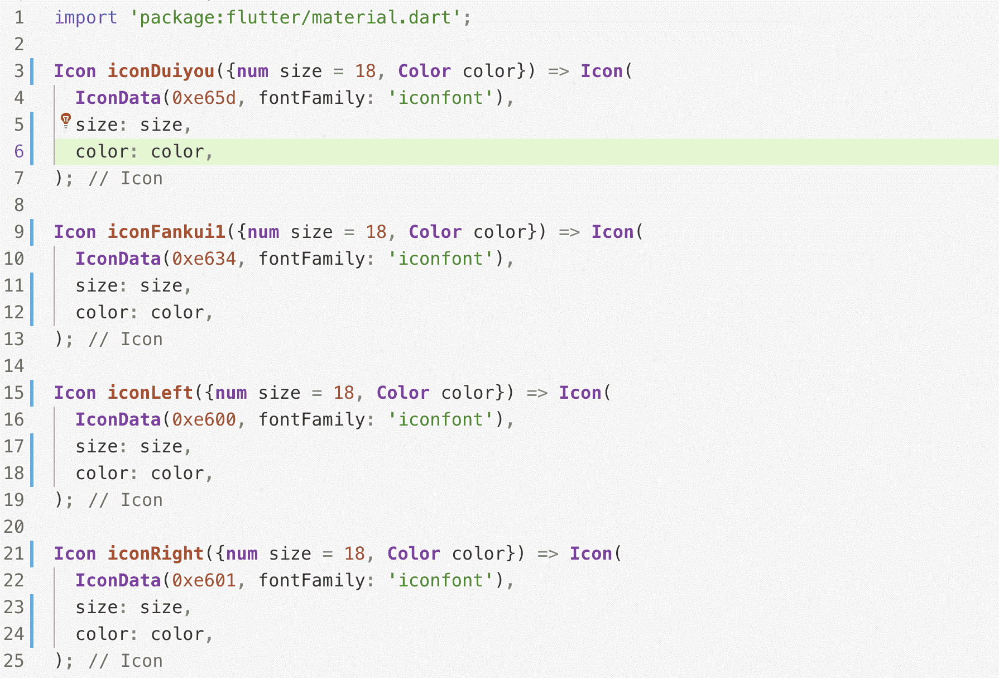

# iconfont_dart

iconfont to dart.Icon can be implemented by calling iconfont classname.
iconfont转dart。通过调用iconfont的classname即可返回Icon。

## 使用

```
import 'package:iconfont_dart/iconfont_dart.dart';

main() {
  IconfontDart('../lib/assets/fonts/demo_index.html', './a.dart');
}
```

## 参数

* 第一个参数：demo_index.html所在的路径
* 第二个参数：生成的dart文件路径

## 生成dart文件预览




